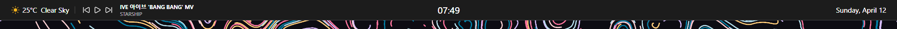

# LegendBar

A lightweight, modern custom top bar for Windows 11 — built with C# and WPF.

LegendBar replaces the missing "top taskbar" that Windows 11 removed, adding live weather, a clock, date, reminders, and media controls in a sleek auto-hiding bar pinned to the top of your screen.



---

## Features

- 🌤️ **Live Weather** — current conditions with icons, auto-detects your location via WiFi
- 🕐 **Clock** — 24-hour format, centered in the bar
- 📅 **Date** — displayed on the right side
- 🔔 **Reminders** — set, view, edit and delete reminders with one-time or repeating schedules
- 🎵 **Media Controls** — shows play/pause, previous, next and song info when media is playing
- ⚙️ **Settings** — adjust bar height, opacity, animation speed, temperature unit and weather refresh rate
- 🚀 **Launch on Startup** — starts automatically with Windows
- 🖱️ **Auto-hide** — smoothly slides in when you hover the top edge, hides when you move away
- 📍 **Auto Location** — uses Windows Location API (WiFi-based) for accurate weather, falls back to IP detection
- 💾 **Weather Cache** — instant weather display on startup using cached data
- 🌦️ **6-Day Forecast** — click the weather widget to expand a full forecast popup

---

## Screenshots


---

## Requirements

- Windows 11 (Windows 10 may work but is untested)
- .NET 10.0
- Internet connection (for weather)
- Location permission (for auto-detect, optional)

---

## Installation

### Option 1 — Download Release

1. Go to the [Releases](../../releases) page
2. Download the latest `LegendBar.zip`
3. Extract and run `LegendBar.exe`
4. Right-click the bar → **Settings** → enable **Launch on Startup**

### Option 2 — Build from Source

1. Clone the repo:

```git
git clone https://github.com/YourUsername/LegendBar.git
```

1. Open `LegendBar.sln` in **Visual Studio 2022**
2. Set build mode to **Release**
3. Press **Ctrl + Shift + B** to build
4. Run `bin/Release/net10.0-windows10.0.19041.0/LegendBar.exe`

---

## Usage

| Action | Result |
|---|---|
| Hover top edge of screen | Bar slides down |
| Move mouse away | Bar slides back up |
| Click weather widget | Opens 6-day forecast popup |
| Right-click bar | Opens context menu |
| Right-click → Add Reminder | Opens reminder form |
| Right-click → View Reminders | Opens reminders list |
| Right-click → Settings | Opens settings popup |
| Right-click → Exit | Closes LegendBar |

---

## Settings

| Setting | Description |
|---|---|
| Bar Height | Adjust the height of the bar (30–60px) |
| Bar Opacity | Control how transparent the bar is |
| Animation Speed | How fast the bar slides in/out |
| Temperature Unit | Switch between °C and °F |
| Weather Refresh | How often weather data is fetched (5–60 min) |
| Launch on Startup | Start LegendBar with Windows |

---

## Tech Stack

- **Language** — C#
- **Framework** — WPF (.NET 10)
- **Weather API** — [Open-Meteo](https://open-meteo.com/) (free, no API key)
- **Geocoding** — [Nominatim / OpenStreetMap](https://nominatim.org/) (free)
- **Location** — Windows Location API (WiFi-based)
- **Weather Icons** — [Meteocons by Bas Milius](https://github.com/basmilius/meteocons) (MIT)
- **Media Icons** — [Lucide Icons](https://lucide.dev/) (MIT)
- **UI Library** — [ModernWpf](https://github.com/Kinnara/ModernWpf) (MIT)
- **SVG Rendering** — [SharpVectors](https://github.com/ElinamLLC/SharpVectors) (BSD)

---

## Project Structure

```git
LegendBar/
├── Assets/
│   ├── Media/          # Media control SVG icons
│   └── Weather/        # Weather condition SVG icons
├── Helpers/
│   ├── AppBarHelper.cs       # Window pinning and Win32 APIs
│   ├── AutoHideHelper.cs     # Auto-hide slide animation
│   ├── LocationService.cs    # WiFi-based location detection
│   ├── ReminderService.cs    # Reminder storage and firing
│   ├── SettingsService.cs    # Settings persistence
│   ├── StartupHelper.cs      # Windows startup registration
│   └── WeatherCache.cs       # Weather response caching
├── Models/
│   ├── Reminder.cs           # Reminder data model
│   └── ReminderViewModel.cs  # Reminder display model
├── Widgets/
│   ├── ClockWidget.xaml      # Clock display
│   ├── MediaWidget.xaml      # Media controls
│   └── WeatherWidget.xaml    # Weather display
├── AddReminderWindow.xaml    # Add/edit reminder form
├── RemindersListWindow.xaml  # View/manage reminders
├── ReminderPopupWindow.xaml  # Reminder alert popup
├── SettingsPopup.xaml        # Settings panel
├── WeatherPopupWindow.xaml   # Weather detail popup
└── MainWindow.xaml           # The main bar window
```

---

## Roadmap

- [ ] WinUI 3 migration (for native Mica Alt support)
- [ ] Fullscreen app detection
- [ ] Multi-monitor support
- [ ] More customizable widgets
- [ ] Plugin/widget system

---

## Credits

- Weather data by [Open-Meteo](https://open-meteo.com/)
- Weather icons by [Bas Milius / Meteocons](https://github.com/basmilius/meteocons)
- Media icons by [Lucide](https://lucide.dev/)
- UI components by [ModernWpf](https://github.com/Kinnara/ModernWpf)

---

## License

MIT License — see [LICENSE](LICENSE) for details.

---

## Contributing

Pull requests are welcome! If you have ideas for new widgets or improvements, feel free to open an issue first to discuss.

1. Fork the repo
2. Create a feature branch (`git checkout -b feature/AmazingWidget`)
3. Commit your changes (`git commit -m 'Add AmazingWidget'`)
4. Push to the branch (`git push origin feature/AmazingWidget`)
5. Open a Pull Request
